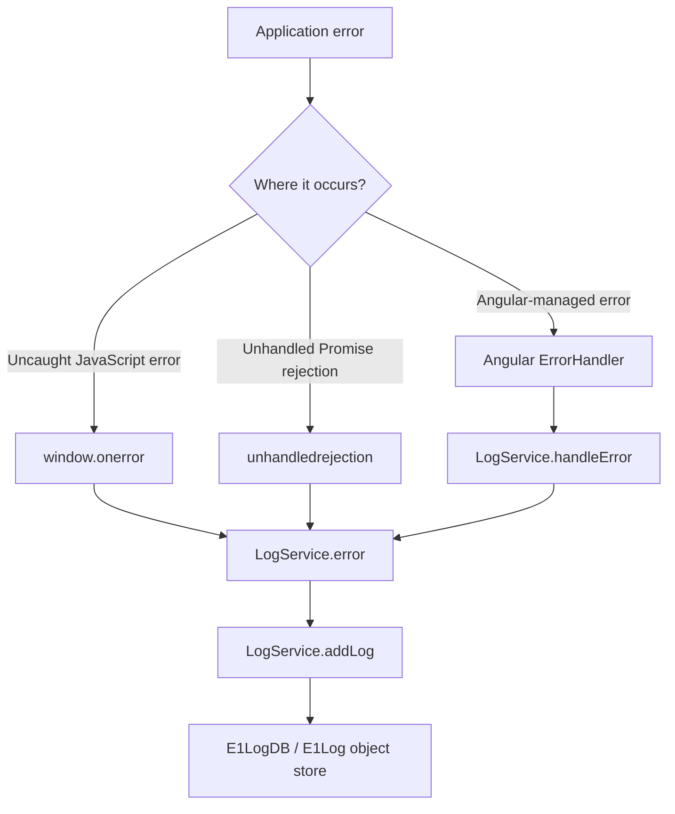

# IndexedDB Demo

This is a small Angular prototype for storing employee and product data in the browser with native IndexedDB. It also includes a separate client-side logging system that stores application logs in its own IndexedDB database.

## Features

- Employee CRUD operations
- Product CRUD operations
- Export of the employee and product data
- Client-side Error, Warning, and Info logging
- Persistent browser-based log storage
- Export of saved logs as a JSON file

## Requirements

- Node.js and npm
- A modern browser with IndexedDB support

The project uses Angular 14. The Angular CLI and application dependencies are listed in `package.json`.

## Setup and Run

Install the dependencies from the project directory:

```bash
npm install
```

Start the Angular development server:

```bash
npm start
```

Open [http://localhost:4200/](http://localhost:4200/) in a browser. The application reloads automatically when source files change.

To create a production build:

```bash
npm run build
```

## Client-Side Logging

### Purpose

The logging system records useful client-side events and errors while the application is running. This is helpful when troubleshooting a browser session, especially when there is no server-side logging endpoint available.

Logs are stored in browser storage instead of only being printed to the console. As a result, they remain available after a page refresh. They also remain available when a user logs out and logs in again in the same browser profile, provided the site data has not been cleared. This application does not currently implement authentication; the logout/login behavior refers to the persistence of the browser data between sessions.

### Why IndexedDB?

IndexedDB is a native browser database designed for structured client-side data. It is used here because it:

- Persists data across page refreshes and browser sessions
- Stores structured log objects instead of one large text value
- Works without an external logging library or server
- Can hold more data than typical synchronous browser storage options
- Is available directly through the browser API

### Separate Database and Service

Logging is intentionally separate from the existing employee/product data service.

| Purpose | Service | Database | Object store |
| --- | --- | --- | --- |
| Employees and products | `IndexedDbService` | `PrototypeDB` | `employees`, `products` |
| Application logs | `LogService` | `E1LogDB` | `E1Log` |

`LogService` does not reuse, modify, or write to the existing `employees` or `products` stores. The logging database is opened independently with native `indexedDB.open()`:

```typescript
indexedDB.open('E1LogDB', 1)
```

During the database upgrade, the service creates the `E1Log` object store with an auto-incrementing `id` key.

## Log Record Format

Each record follows the `E1Log` interface:

| Field | Type | Description |
| --- | --- | --- |
| `id` | `number` | Auto-generated IndexedDB key |
| `LogType` | `string` | Log category, such as `Error`, `Warning`, or `Info` |
| `Message` | `string` | Main log message |
| `DateTime` | `string` | ISO timestamp created by `new Date().toISOString()` |
| `Url` | `string` | Current page URL when the log was created |
| `Stack` | `string` | Optional error stack or source information |

Example error record:

```json
{
  "id": 1,
  "LogType": "Error",
  "Message": "Unable to load employee data",
  "DateTime": "2026-09-29T12:00:00.000Z",
  "Url": "http://localhost:4200/",
  "Stack": "Error: Unable to load employee data"
}
```

The service exposes these log methods:

```typescript
logService.error('Something failed', stack);
logService.warning('A recoverable problem occurred');
logService.info('The operation completed');
```

`error()` includes the optional stack. `warning()` and `info()` store the message, timestamp, and current URL.

## How Errors Are Captured

`LogService` implements Angular's `ErrorHandler` interface. It is registered globally in `app.module.ts`:

```typescript
providers: [
  {
    provide: ErrorHandler,
    useExisting: LogService
  }
]
```

`useExisting` tells Angular to use the existing singleton `LogService` instance when it needs an `ErrorHandler`.

The service also registers two browser-level handlers in its constructor:

- `window.onerror` captures uncaught JavaScript runtime errors.
- `unhandledrejection` captures rejected Promises that do not have a rejection handler.

The normal console behavior is preserved. The handlers send a copy to the logger and allow the browser's usual error handling to continue.

### Error Flow



In detail:

1. An Angular-managed error reaches `LogService.handleError()`, or a browser-level error reaches `window.onerror` or `unhandledrejection`.
2. The service extracts the message and stack when available.
3. `LogService.error()` creates an `E1Log` record with type `Error`, the current URL, and an ISO timestamp.
4. `addLog()` waits for the database to open, starts a read/write transaction, and adds the record to `E1Log`.
5. The record remains in `E1LogDB` until the site data is cleared or the database is otherwise removed.

If saving a log fails, the service reports the logging failure to the console and does not intentionally break the application.

## Testing the Logger

The application includes a **Test Logging** button. It creates one `Error`, one `Warning`, and one `Info` record through the public `LogService` methods.

To test the browser-level handlers, open the browser DevTools Console and run these examples separately:

Test `window.onerror`:

```javascript
setTimeout(() => {
  throw new Error('Test uncaught browser error');
}, 0);
```

Test `unhandledrejection`:

```javascript
Promise.reject(new Error('Test unhandled promise rejection'));
```

After running either example, inspect the `E1Log` object store to confirm that a new `Error` record was created.

## Viewing Logs in Browser DevTools

In Chrome or Edge:

1. Open DevTools with `F12` or `Ctrl+Shift+I`.
2. Open the **Application** panel.
3. Expand **Storage** and select **IndexedDB**.
4. Expand the application origin, such as `http://localhost:4200`.
5. Select `E1LogDB`.
6. Select the `E1Log` object store to view the saved records.

Refresh the page and check the same store again. The records should still be present because IndexedDB is persistent browser storage. Logging out and logging in again also does not remove them unless the application or the user clears the site's browser data.

## Exporting Logs

Click **Export Error Logs** in the application header to call `LogService.exportLogs()`.

The method reads all records from `E1Log`, converts them to formatted JSON, and downloads a file named like:

```text
E1Log_2026-09-29.json
```

The exported file can be attached to a bug report or shared with a support team during troubleshooting. If there are no saved logs, the service writes a warning to the browser console instead of downloading an empty file.

The existing **Export Data** button is separate. It exports employee and product data through `IndexedDbService`; it does not export the `E1LogDB` records.

## Practical Limitations

- Logs are local to the browser and device. They are not automatically sent to a server or shared between browsers.
- Clearing site data, using private browsing, or deleting the `E1LogDB` database removes the stored logs.
- IndexedDB availability and storage limits are controlled by the browser.
- Angular's `ErrorHandler` does not automatically capture every handled HTTP or API error. For example, an HTTP request handled by an RxJS `catchError()` may never reach the global error handler. Such cases must be logged explicitly where the application handles them.
- A logging failure is reported in the console; the logger is designed not to replace normal application behavior.
- `window.onerror` and `unhandledrejection` are intended for uncaught runtime failures. Errors that are caught and handled by application code must be passed to `logService.error()` explicitly if they should be recorded.

## Project Structure

The logging implementation is located here:

```text
src/app/services/log.service.ts       Client-side logging service
src/app/services/log.service.spec.ts  Basic service test
src/app/app.module.ts                  Global ErrorHandler registration
src/app/app.component.ts               Test Logging and Export Error Logs actions
```

No external logging library is required. The implementation uses Angular's `ErrorHandler`, the browser's global error events, and the native IndexedDB API.